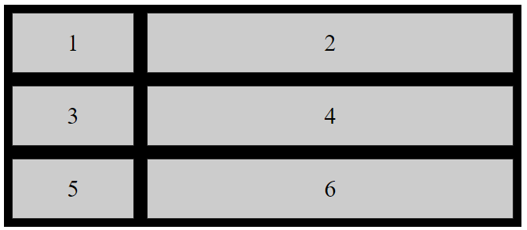
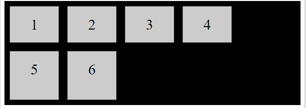
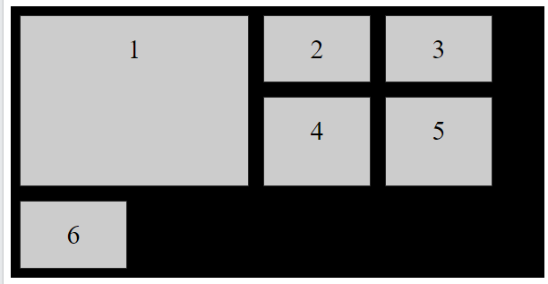

## Http Nedir?

Hyper Text Transfer Protokol(HTTP) web’in uygulama katmanında 80 port numarası ile çalışan bir prokoldür. Web’in kalbi diyebiliriz. Http 2 programda uygulanır: istemci(client) programı ve sunucu(server) programı. **Server** ve **Client**, uç sistemleri çalıştırarak, http mesajlarını birbirleri ile değiştirerek mesajlaşırlar. Bu mesajların yapısı HTTP tarafından tanımlanır

## HTTP Metodları Nelerdir?

- GET
- POST
- PUT
- HEAD
- DELETE
- PATCH
- OPTIONS
- CONNECT
- TRACE

### En yaygın olanları **GET** ve **POST** metodudur.

### GET Metodu

Kaynaktan bir veri talep edilidğinde kullanılır.
GET metodunda sorgu dizisi(örnek olarak isim ve deger) URL'in içine eklenerek gönderilir.

```
/test/index.html?isim1=deger1&isim2=deger2
```

### POST Metodu

POST, bir kaynağı oluşturmak/güncellemek için bir sunucuya veri göndermek için kullanılır.
POST ile gönderdiğimiz veriler HTTP Request mesajının body kısmında saklanır.

```
POST /test/index.html HTTP/1.1
Host: exampleite.com

isim1=deger1&isim2=deger2
```

### PUT Metodu

PUT, bir kaynağı oluşturmak/güncellemek ve bir sunucuya veri göndermek için kullanılır. POST ve PUT arasındaki fark, PUT isteklerinin önemsiz olmasıdır. Yani, aynı PUT isteğini birden çok kez çağırmak her zaman aynı sonucu verecektir. Buna karşılık, bir POST isteğini tekrar tekrar çağırmak, aynı kaynağı birden çok kez yaratmanın zararlarına sahiptir.

### HEAD Metodu

HEAD, GET ile hemen hemen aynıdır, ancak yanıt gövdesi yoktur. Başka bir deyişle, GET /users bir kullanıcı listesi döndürürse, HEAD /users aynı isteği yapar ancak kullanıcı listesini döndürmez. HEAD istekleri, büyük bir dosya veya yanıt gövdesini indirmeden önce olduğu gibi, bir GET isteğinde bulunmadan önce bir GET isteğinin ne döndüreceğini kontrol etmek için kullanışlıdır.

### DELETE Metodu

DELETE metodu, belirtilen kaynağı siler.

### PATCH Metodu

PUT gibi kaynağı güncellemekte kullanılır ama PUT dan farklı olarak PATCH yöntemi, bir kaynağa kısmi değişiklikler uygulamak için kullanılır.

### OPTIONS Metodu

hedef kaynak için iletişim seçeneklerini açıklar.

### CONNECT Metodu

istenen kaynakla iki yönlü bir iletişim (bir tünel) başlatmak için kullanılır.

### TRACE Metodu

Bu metod ile bir sunucuya istek gönderdiğinizde, aradaki tüm vekil sunucular (Proxy, Gateway) isteğin başlığına kendi IP veya DNS biglilerini eklerler. Genellikle hata ayıklama/bakım işleri için kullanılır.

## HTTP Durum kodları

- 1xx Bilgilendirici
- 2xx Başarı
- 3xx Yönlendirme
- 4xx İstemci Hatası
- 5xx Sunucu Hatası olduklarını temsil ederler.

```
xx burada 00-99 arasında sayılardır. En Çok karşılaşılan kodlar aşağıdaki gibidir:
```

- HTTP Status Code 200 - OK.
- HTTP Status Code 301 – Permanent Redirect.
- HTTP Status Code 302 - Temporary Redirect.
- HTTP Status Code 404 - Not Found.
- HTTP Status Code 410 - Gone.
- HTTP Status Code 500 - Internal Server Error.
- HTTP Status Code 503 - Service Unavailable.

---

## API Nedir?

Application Programming Interface (API), iki uygulamanın herhangi bir kullanıcı müdahalesi olmadan birbiriyle etkileşime girmesine izin veren bir yazılım arayüzüdür. API, yazılım işlevleri ve prosedürlerinin bir koleksiyonudur. Basit bir ifadeyle API, erişilebilen veya yürütülebilen bir yazılım kodu anlamına gelir. API, iki farklı yazılımın birbirleriyle iletişim kurmasına ve veri alışverişinde bulunmasına yardımcı olan bir kod olarak tanımlanır.


## API’ler Nasıl çalışır?

API mimarisi genellikle istemci ve sunucu bakımından açıklanır. İsteği gönderen uygulamaya istemci, yanıtı gönderen uygulamaya ise sunucu adı verilir. Yani hava durumu örneğinde, müdürlüğün hava durumu veritabanı bir sunucu iken, mobil uygulama ise bir istemcidir.

Günlük hayattan bir örnekle açıklamak gerekirse:
Yemek yemek için bir restoranta gittiğinizi hayal edin. Yemek Sipariniz için masaya bir garson gelir ve size bir menü uzatır. Sizde bu menüden istediklerinizi kendinize göre filtreleyip(mesela az pişmiş olsun) garsona söylersiniz. Bir süre sonra yemeğiniz masanıza gelir. Burada garson önemli bir rol oynar ve sizi mutfaktaki çalışanlar ile iletişime girmenizden kurtarır.

## Neden bir API'ye ihtiyacımız duyarız?

- API, iki farklı yazılımın birbirleriyle iletişim kurmasına ve veri alışverişinde bulunmasına yardımcı olur.
- Herhangi bir siteden veya uygulamadan içeriği daha verimli bir şekilde yerleştirmenize yardımcı olur.
- API'ler uygulama bileşenlerine erişebilir. Hizmetlerin ve bilgilerin sunumu daha esnektir.
- Oluşturulan içerik otomatik olarak yayınlanabilir.
- Kullanıcının veya bir şirketin en çok kullandıkları içerik ve hizmetleri özelleştirmesine olanak tanır.

## API’lerin özellikelri

- Değerli bir hizmet sunar (veri, işlev, izleyici,.).
- Bir iş modeli planlamanıza yardımcı olur.
- Basit, esnek, hızlı bir şekilde adapte edilebilinir.
- Yönetilen ve ölçeklenebilir.

## Kullanım alanlarına göre API türleri nelerdir?

### Internal API'ler

Bunlar, her bir kurumda dahili kullanım içindir ve sadece işletmenin içindeki sistem ve verileri bağlamak için kullanılır.

### Public/Open API'ler

Bunlar, halka açık olup herkes tarafından kullanılabilir. Bu API türlerinin bazıları için yetkilendirme adımları ve maliyetler söz konusuyken, bazıları tamamen açık ve ücretsizdir.

### Partner API'leri

Bunlar, sadece işletmeler arası ortaklıklarda yardım sağlamaları için yetkilendirilmiş harici geliştiricilerin erişimine açıktır.

### Composite API'ler

Bunlar, karmaşık sistem gereksinimlerini veya davranışlarını ele almak üzere iki veya daha fazla API'yi bir araya getirir.

## Mimari ve Protokollore göre API’ler nelerdir?

### REST API

REST (representational state transfer) çok popüler bir web API mimarisidir.. REST, istemcilerin sunucu verilerine erişirken kullanabilmesi için GET,POST, PUT, DELETE gibi belirli işlevler kullanır. İstemciler ve sunucular, HTTP üzerinden veri alışverişi yapar.
Bir API'nin REST API olması için aşağıdakiler dahil belirli mimari kısıtlamalara veya ilkelere uyması gerekir:

İstemci-sunucu mimarisi: arayüz, arka uçtan ve veri deposundan ayrılmıştır. Bu, esnekliğe ve farklı bileşenlerin birbirinden bağımsız olarak gelişmesine olanak tanır.
Durumsuzluk: sunucuların istekler arasında istemci verilerini kaydetmemesi anlamına gelir.
Önbelleğe alınabilirlik: istemciler yanıtları önbelleğe alabilir, bu nedenle bir REST API yanıtı, önbelleğe alınıp alınamayacağını açıkça belirtmelidir.
Katmanlı sistem: API, doğrudan bir sunucuyla veya yoksa yük dengeleyici gibi bir aracı aracılığıyla iletişim kurmaya çalışacaktır.

### SOAP API'leri

Bu API'ler, Basit Nesne Erişimi Protokolünü kullanır. İstemci ve sunucu, XML aracılığıyla mesaj alışverişi yapar. Bu, diğerlerine kıyasla pek esnek olmayan ve artık popülerliğini yitiren bir API'dir.

### RPC API'leri

Bu API'lere, Uzak Prosedür Çağrıları adı verilir. İstemci, önce sunucu üzerinde bir işlevi (yani prosedür) tamamlar ve ardından sunucu da çıktıyı istemciye gönderir.

### WebSocket API'leri

WebSocket API'leri, verileri aktarmak için JSON nesneleri kullanan başka bir modern web API'si gelişimidir. Bir WebSocket API'si, istemci uygulamaları ile sunucu arasında iki yönlü iletişimi destekler. Sunucunun bağlı istemcilere geri arama mesajları gönderebilmesi nedeniyle REST API'lerinden daha verimlidir.

## API'lerin iletişim düzeyi:

Burada, API 'nin bazı iletişim düzeyleri verilmiştir:

### High-level API'ler:

High-level API'ler, programcıların yüksek düzeyde soyutlamaya sahip olduğu REST biçiminde genellikle kullanabileceğimiz API'lerdir. Bu API'ler çoğunlukla sınırlı bir işlevsellik gerçekleştirmekle ilgilenir.

### Low-level API'ler:

Bu tür API'ler daha düşük bir soyutlama düzeyine sahiptir, bu da daha ayrıntılı oldukları anlamına gelir. Programcının bir uygulama modülü veya donanım içindeki işlevleri ayrıntılı bir düzeyde değiştirmesine olanak tanır.

### Web API'leri nedir?

Web API, web sunucusu veya web tarayıcısı için kullanılan bir uygulama programlama arabirimidir.

İki tür Web API'si şunlardır: 1) server side API 2) client side API

### Server side:

Sunucu tarafı web API, tanımlanmış bir istek-yanıt mesaj sistemine genel olarak açık bir veya daha fazla uç noktadan oluşan programlı bir arayüzdür. Genellikle JSON veya XML olarak ifade edilir.

### Client side

İstemci tarafı web API'si, bir web tarayıcısı veya başka bir HTTP istemcisi içindeki işlevselliği genişletmeye yardımcı olan programlı bir arayüzdür.

## Web API örnekleri:

Google Haritalar API'leri, geliştiricilerin bir JavaScript veya Flash arayüzü kullanarak Google Haritalar'ı web sayfalarına yerleştirmesine olanak tanır.
YouTube API, geliştiricilerin YouTube videolarını ve işlevlerini web sitelerine veya uygulamalara entegre etmesine olanak tanır.
Twitter iki API sunar. REST API, geliştiricilerin Twitter verilerine erişmesine yardımcı olur ve arama API'si, geliştiricilerin Twitter Arama ile etkileşim kurması için yöntemler sağlar.
Amazon'un API'si, geliştiricilere Amazon'un ürün seçimine erişim sağlar.

#### API Test araçları

- Postman
- ReadyAPI
- Katalon Studio
- TestGrid
- ReadyAPI
- Eggplant
- Ve daha fazlası..

---

## HTML Accessibility

HTML kodlarını anlamsal(semantic) açıdan daha açıklayıcı yazmak sitemizi kullanacak kullanıcılar , derleyecek browserlar ve indexleyecek arama motorları için daha iyi bir seçenekdir.

## Semantic HTML

Bunun anlamı, HTML elementlerini mümkün olduğunca elementin amaçlandığı doğrultuda kullanmak demektir. Yani kısaca eğer senin sayfanda bir butona ihtiyacın var ise bu yapıyı kullanmak yerine

```html
<div>bu bir butondur</div>
```

aşağıdaki yapı şeklinde kullanmalısın.

```html
<button>bu bir butondur</button>
```

Semantic HTML, bir sayfanın içeriğini yüksek sesle okuyan ekran okuyuculara olanak sağlar.
Buton örneğini ele alırsak:

- Buton elementi varsayılan olark daha iyi bir stile sahip
- Ekran okuyuca elementimizin bir buton olduğunu tanımyabilir.
- Odaklabilir ve tıklanabilir.

##### non-semantic elementler için örnek olarak:

```html
<div>
  <span>bu yapıyı kullanmak bize içerik hakkında pek bir şey anlatmaz.</span>
</div>
```

##### semantic element için bu örnek :

```html
<form>
  <table>
    <article>- bizi içerik hakkında fazlaca bilgi sahibi yapar.</article>
  </table>
</form>
```

## Başlıklar

```html
<h1>Heading 1</h1>
<h2>Heading 2</h2>
<h3>Heading 3</h3>
<h4>Heading 4</h4>
<h5>Heading 5</h5>
<h6>Heading 6</h6>
```

Arama motorları, web sayfalarınızın yapısını ve içeriğini dizine eklemek için başlıkları kullanır. Kullanıcılar sayfalarınızı başlıklarına göre gözden geçirir. Belge yapısını ve farklı bölümler arasındaki ilişkileri göstermek için başlıkların kullanılması önemlidir. Ekran okuyucular ayrıca başlıkları gezinme aracı olarak kullanır. Farklı başlık türleri, sayfanın ana hatlarını belirtir. Ana başlıklar için `<h1>` başlıkları, ardından `<h2>` başlıkları, ardından daha az önemli olan `<h3>` vb. kullanılmalıdır.

## Alternative Text

Bu özellik kullanıcı sayfaya eklediğimiz görseli herhangi bir nedenden dolayı görüntüleyememesi durumunda görselin yerinde oluşan boşlukta o görsel hakkında açıklayıcı bir metni kullanıcıya gösterir.

```html

```

## Dil Tanımlamak

Web sayfasının dilini bildirmek için her zaman `<html>` etiketinin içine lang niteliğini eklemelisiniz. Bu, arama motorlarına ve tarayıcılara yardımcı olmak içindir. Aşağıdaki örnek, dil olarak İngilizce'yi belirtir:

```html
<!DOCTYPE html>
<html lang="en">
  <body>
    ...
  </body>
</html>
```

## Klavye için tabindex

Kılavye ile sayfada gezinmeyi tercih eden kullanıcılar için elemneleriimize tabindex özelliğini eklemeliyiz

```html
<button tabindex="0">Click me!</button>
<button tabindex="1">Click me too!</button>
<button tabindex="2">And me!</button>
```

## İyi bit link Metni Oluşturmak

Bir bağlantı metni, okuyucunun o bağlantıya tıklayarak hangi bilgileri alacağını açıkça açıklamalıdır.
Örneğin, aşağıda iyi bir bağlantı metni örneği gösterilmektedir:

bu örnek iyi bir link metni oluşturur.

```html
<p>
  Balinalar gerçekten harika yaratıklar.
  <a href="whales.html">Balinalar hakkında daha fazla bilgi edinin</a>.
</p>
```

ama bu örnek yukarıdaki kadar iyi değildir.

```html
<p>
  Balinalar gerçekten harika yaratıklar. Balinalar hakkında daha fazla bilgi
  edinmek için <a href="whales.html">burayı tıklayın</a>.
</p>
```

## Form elementleri

Form elementleri kullanıcıyı yönlendirmek açısından çok önemlidir.

```html
İsmini doldur: <input type="text" id="name" name="name" />
```

Ancak, bu engelli kullanıcılar için pek kullanışlı değildir. Yukarıdaki örnekte, etiketi açık bir şekilde form girişiyle ilişkilendirecek ve göremiyorsanız nasıl doldurulacağını netleştirecek hiçbir şey yoktur. Buna bazı ekran okuyucularla erişirseniz, size yalnızca "metni düzenle" satırları boyunca bir açıklama verilebilir. Aşağıdaki çok daha iyi bir örnektir:

```html
<div>
  <label for="name">İsmini Doldur</label>
  <input type="text" id="name" name="name" />
</div>
```

Burda İsmini doldur yazısı input elementi ile ilişkilendirilmiştir.

---

## Css

### Media Queries

Responsive tasarım yaparken kullandığımız bir css özelliğidir. Yani farklı width ve height değerlerine sahip cihazlar için sayfamızı okunaklı ve göze hoş gelen bir şekilde göstermek.

Bir media özelliği:

```css
@media not|only mediatype and (mediafeature and|or|not mediafeature) {
  CSS-Code;
}
```

Şeklinde tanımlanır.

### And ,not ve only anlamaları

**Not**: Yaptığımız media stillerini tam tersi şeklinde çalışmasını sağlar.
**Only**: MQ leri desteklemeyen eski tarayıcıların MQ stillerni uygulamasını engeller.
**And**: MQ lerini başka bir MQ ile ya da bir media type ile birleştirmesini sağlar.

### Media tipleri leri

**All**: tüm media tipi ciıhazlar için varsayılan olarak kullanılır.
**Print**: yazıcılar için kullanılır.
**Screen**: pc, table,telefonv cihazlar için kullanılır.
**Speech**: ekran okuyucaları için kullanılır.

```css
body {
  background-color: yellow;
}
```

Ekranın width değeri 700px ve daha küçük olduğu durumunda arkaplan rengini sarıdan maviye çevirsin.
```css
@media only screen and (max-width:700px){
    body{
      background-color:blue;
  }
}
```

Eğer ekranı yazdırmak istediğimde bir değişiklik yapmak istersem:
```css
body {
  color: black;
  background-color: grey;
}

@media print {
    body {
      background-color: transparent;
    }
}
```

Diyelim ki tarayıcı penceresinin Landscape modda (viewport width height dan daha büyük) veya portarit modda (viewport height width den daha büyük olmasına bağlı olarak farklı stiller uygulamak istiyorsunuz. Bunu test etmek için kullanabileceğiniz ```orientation``` adında bir medya özelliği var:

```css
@media all and (orientation: landscape) {
// Styles for landscape mode.
}
@media all and (orientation: portrait) {
// Styles for portrait mode.
}
```
---

## Display
Bu özellik elementin sayfa içindeki görüntülenme biçimi ve konumunu belirler.
Display propertisi block,inline,gird,flex gibi valueler alır.

**display:block;** elementi bir block elementi haline getirir yani tüm satırı kapsayacak şekilde bir alan kaplar.
**display:inline;** elementi bir inline elementi halinde görüntülenmseini sağalar. Yani herhangi bir yeni satıra geçmeden, olan satır içinde diğer inline elementler ile yan yana gözükür.
**display:none;** elementi sayfa içinde gizler bu ```visibility:hidden;``` a benzer ama ondan farkı sayfa içinde elemnti orjinal botuylarında boşluk oluşturyacak şekilde gizler. Bu diğerinde tam tersidir.sayfada bir boşluk görürüz.
```html
<!DOCTYPE html>
<html>
<head>
<style>
p.ex1 {display: none;}
p.ex2 {display: inline;}
p.ex3 {display: block;}
</style>
</head>
<body>
<h1>The display Property</h1>
<h2>display: none:</h2>
<div>Lorem ipsum dolor sit amet, consectetur adipiscing elit. Etiam semper diam at erat pulvinar, at pulvinar felis blandit. <p class="ex1">HELLO WORLD!</p> Vestibulum volutpat tellus diam, consequat gravida libero rhoncus ut.</div>
<h2>display: inline:</h2>
<div>Lorem ipsum dolor sit amet, consectetur adipiscing elit. Etiam semper diam at erat pulvinar, at pulvinar felis blandit. <p class="ex2">HELLO WORLD!</p> Vestibulum volutpat tellus diam, consequat gravida libero rhoncus ut.</div>
<h2>display: block:</h2>
<div>Lorem ipsum dolor sit amet, consectetur adipiscing elit. Etiam semper diam at erat pulvinar, at pulvinar felis blandit. <p class="ex3">HELLO WORLD!</p> Vestibulum volutpat tellus diam, consequat gravida libero rhoncus ut.</div
</body>
</html>
```
## Ekran çıktıları:
### display: none:
Lorem ipsum dolor sit amet, consectetur adipiscing elit. Etiam semper diam at erat pulvinar, at pulvinar felis blandit. Vestibulum volutpat tellus diam, consequat gravida libero rhoncus ut.
### display: inline:
Lorem ipsum dolor sit amet, consectetur adipiscing elit. Etiam semper diam at erat pulvinar, at pulvinar felis blandit. 
```HELLO WORLD! ```Vestibulum volutpat tellus diam, consequat gravida libero rhoncus ut.
### display: block:
Lorem ipsum dolor sit amet, consectetur adipiscing elit. Etiam semper diam at erat pulvinar, at pulvinar felis blandit.
###### HELLO WORLD!
Şeklinde olacaktır.

### display:grid;
Element bir blok elementi gibi davranır ve içeriğini ```grid modeline``` göre düzenler.
### display:flex;

Element bir blok elementi gibi davranır ve içeriğini ```flexbox modeline``` göre düzenler.

---
### Grid Layout

Bu yapı elementlerimizi yatay ve dikey çizgiler şeklide oluşturlmuş bir ızgara(grid) yapısının içinde sırlamaktır.
Çizgielr burada Column ve Row şeklinde tanımlanır. Daha iyi anlamak için bir örnek üzerinden gidelim.

```html
<div class='container'>
      <div class="item1">1</div>
      <div class="item2">2</div>
      <div class="item3">3</div>
      <div class="item4">4</div>
      <div class="item5">5</div>
      <div class="item6">6</div>
</div>
```

```css
      .container{
          display: grid;
          grid-template-columns: 1fr 2fr;
          grid-gap:1rem;
          background-color:black;
          padding: 10px;
      }
      .container>div{
         background-color: rgba(255, 255, 255, 0.8);
         border: 1px solid rgba(0, 0, 0, 0.8);
         padding: 20px;
         font-size: 30px;
         text-align: center;
      }
```
ekran çıktısı:


 ```css
     grid-template-columns: 1fr 2fr;
 ```
Burada 1fr 2fr görüyoruz bunun anlamı, elemenlerin column olarak hangi oranda yerleşemesi gerektiğini ayrlıyor.
containeri 3 parça düşünürsek,  ilk eleman 1 bölümü diğer eleman 2 bölümüne yerleşmiş olur.

 ```css
      grid-gap:1rem;
 ```
Burada ise elemenetler arsındaki boşukları ayarlıyoruz. gap, ```row-gap``` ve ```column-gap ```için bir shorthanddir.

ayrıca 
```css
      .container{
          display: grid;
          grid-template-columns: repeat(4,100px);
          grid-template-rows: 75px 100px;
          grid-gap:1rem;
          background-color:black;
          padding: 10px;
      }
      .container>div{
         background-color: rgba(255, 255, 255, 0.8);
         border: 1px solid rgba(0, 0, 0, 0.8);
         padding: 20px;
         font-size: 30px;
         text-align: center;
      }
```
ekran çıktısı:


 ```css
     grid-template-rows: 75px 100px;
 ```
Bu kez rows özelliğini görüyoruz. Burada ilk satırın 75px uzunluğunda 2.satırın ise 100px uzunluğuna sahip olmasını istiyoruz.
Ayrıca yukarıda yeni gördüğümüz bir kavram var ```repeat()```
```repeat(4,100px)``` bizi eğer her column için aynı sitili uygulayacağımız zaman kod tekarından alı koyuyor. yani her columnn için column u 4 parça halinde her parça 100px genişliğe sahip olacak şekilde ayrla diyor.

Şuana kadar ana kapsayıcı üzerinden grid değerlerini ayarladık Peki spesifik bir element için column ve row ayarını nasıl yapacağız?

 ```css
      .container{
          display: grid;
          grid-template-columns: repeat(4,100px);
          grid-template-rows: 75px 100px;
          grid-gap:1rem;
          background-color:black;
          padding: 10px;
      }
      .container>div{
          background-color: rgba(255, 255, 255, 0.8);
          border: 1px solid rgba(0, 0, 0, 0.8);
          padding: 20px;
          font-size: 30px;
          text-align: center;
      }
      .item1 {
          grid-column-start: 1;
          grid-column-end: 3;
          grid-row-start: 1;
          grid-row-end: 3;
      }
 ```


Burada 1. elamanının yatayda 1-3 yani 2 lik kısmı kapsamasını aynı şekilde dikeyde ise 2 lik kısmı kapsamasını isitiyorum.
```grid-column:x/y;```, ``` grid-column-start``` ve ```grid-column-end``` yerine   bir kısayoldur. benzer şekilde,
```grid-row:x/y;```, ``` grid-row-start``` ve ```grid-row-end``` yerine   bir kısayoldur.


## Flex Layout
Bu yapı position veya float özellikleri kullanmadan sayfa düzeni için esenk bir tasarım imkanı sunar.
Buradada flex özlliğini elementlere uygulamk için bir ana kapsayıcıya ihtiyac var.

```html
<div class="flex-container">
  <div>1</div>
  <div>2</div>
  <div>3</div>
</div>
```

```css
.flex-container {
  display: flex;
}
```
flex container özellikelri:
+ flex-direction
+ flex-wrap
+ flex-flow
+ justify-contnet
+ align-items

## flex-direction
bu özellik container ın hangi yönde sıralanmsaı gerktiğini ifade eder. ```column```, ```column-reverse```, ```row```ve  ```row-reverse``` değerleri alır ```row``` değeri bu özellik için defaultdır.

yukarıdaki görselde sırasyıyla ```column```, ```column-reverse```, ```row```ve  ```row-reverse``` değerlerini aldığındaki görüntüsünü görüyoruz. Fark ettiyseniz reverse olduğunda sayılar yani elementler tersten sıralanmış.

## flex-wrap
Bu özellik flex elementlerinin bir alt satıra geçip geçmeyeceği ayaralanmasını sağlar. ```wrap```,```no-wrap``` ve```wrap-reverse``` değerlerini alır.

```flex-wrap:wrap ```değerini alırsa

```html

<div class="flex-container">
  <div>1</div>
  <div>2</div>
  <div>3</div>  
  <div>4</div>
  <div>5</div>
  <div>6</div>  
</div>

```
6 elemntiizin olduğunu ve 
şu stile sahip olduğunu düşünün.

```css
.flex-container {
  display: flex;
  flex-wrap: wrap;
  background-color: DodgerBlue;
}

.flex-container > div {
  background-color: #f1f1f1;
  width: 100px;
  margin: 10px;
  text-align: center;
  line-height: 75px;
  font-size: 30px;
}
```

 
şeklinde olur ve sayfayı genişlettğimizde elemenetler bir üst satıra, daralltığımızda ise alt satıra kayarlar.

```flex-wrap:no-wrap ```değerini alırsa elementler hep tek satır halinde kalır.
 

## flex-flow 
Bu özellik  ```flex-direction``` ve ```flex-wrap``` için kısayoldur.

## justify-content ve align-items
Bu özellik eğer ```flex-direction:row;``` ise   ```justify-content``` row yönünde ```align-items``` column yönünde etki eder.
Ama eğer ```flex-direction:column;``` ise tam tersi şeklinde etki ederler.

### justify-content
+ center
+ space-between
+ space-evenly
+ space-around 
+ flex-end
+ flex-start 

### align-items
+ center
+ sterch
+ baseline
+ flex-end
+ flex-start 

gibi değerler ile elementlerin birbirleri arsındaki boşlukları ve birbilerine göre hizalanmalrını belirlerler.


## flex items özellikleri
+ order
+ flex-grow
+ flex-shrink
+ flex-basis
+ flex

## order 
flex itemların sırasını belirler. default değeri 0 dır.

```html
  <div class="flex-container">
      <div style="order: 3">1</div>
      <div style="order: 2">2</div>
      <div style="order: 4">3</div>
      <div style="order: 1">4</div>
  </div>
```


## flex-shrink

Bu özellik sekme boyutu küçültüğünde hangi elementin ne kadar kıslaması gerktiğini ifade eder.
```css
    .item1{
      flex-shrink:0;
      }
```

## flex-grow

Bu özellik sekme boyutu büyütüldüğünde hangi elementin ne kadar büyük genişlemsei gerktiğini ifade eder.
```css
    .item2{
      flex-grow:1;
      }
```

## flex-basis

Bu özellik , flex bir itemın başlangıç ​​uzunluğunu belirler.
```css
    .item3{
      flex-basis:100px;
      }
```

## flex

```flex``` propertisi , ```felx-grow``` ,```felx-shrink``` ve ```felx-basis``` için kısayoldur.

## Position 

Bir elementin pozisyonu için olan metodları tanımlar.
Bu metodlar : ```static``` , ```fixed``` , ```absoulte``` , ```relative``` ve ```sticky``` dir.
Bu metodları tanımladıktan sonra ```top``` ,```bottom``` ,```left```ve ```right``` propretilerini kullanarak sayfa içinde nereye yerleşeceklerini belirleriz.

#### position: static;
Position propertisi için default olan değerdir. 

```top``` ,```bottom``` ,```left```ve ```right``` değerlerinden etkilenmezler. Özel bir pozisyon ayarlaması yoktur. Sayfanın normal akışına göre yerleşirler.


#### position: relative;
sayfanın kendisne göre konumlancaktır top,left gibi değerler ile sayfa içinde yerleştirilebilir.


#### position: fixed;
viewport yani kullanıcıya görünen ekrana göre konumlancaktır. Ama scroll olma durumnda yerini kaybetmeyip orada sabit kalacktır.

#### position: absoulte;
relativi olduğu parnet elemente göre sayfa içinde konumlancaktır.

```html
<head>
<style>
div.relative {
  position: relative;
  width: 400px;
  height: 200px;
  border: 3px solid #73AD21;
} 

div.absolute {
  position: absolute;
  top: 80px;
  right: 0;
  width: 200px;
  height: 100px;
  border: 3px solid #73AD21;
}
</style>
</head>
<body>

<div class="relative"> position: relative;
  <div class="absolute">position: absolute;</div>
</div>

</body>
</html>

```


#### position: sticky;
Relative ve fixed karışımı bir şeydir. Viewporta göre relative şekilde ekranda duruken scorll olduğunda fixed duruma geçip ekranda sabit kalmaya devam edecektir.

---
## Keyframes

Elementlere animasyon katmak için kullanılır.

```css

@keyframes animationname {keyframes-selector {css-styles;}}

```

şeklinde tanımlanır.Animsayon adı anime etmek istedğimiz css elemntinin ```animation:;``` propertisi içine yazılır. Ve böylelikle o elemnte animsayon özelliği eklemiş oluruz.

### keyframes-selector

0 ile 100% arasında değerlerden oluşur veya from(0 ile aynı) to(100% ile aynı) değerlerinden oluşur.

örnekte olşturuduğumuz kutu sonuza dek -sayfa açık kaldığı müddetçe yani- aşağı inip yukarı çıkacaktır.

```html
<!DOCTYPE html>
<html>
<head>
<style> 
div {
  width: 100px;
  height: 100px;
  background: red;
  position: relative;
  animation: mymove 5s infinite;
}

@keyframes mymove {
  0%   {top: 0px;}
  25%  {top: 200px;}
  75%  {top: 50px}
  100% {top: 100px;}
}
</style>
</head>
<body>
<div></div>
</body>
</html>
```
---
## DOM Manipulation / Js events

DOM maniplasyonu Js kodalarını kullanarak HTML elementleri üzerinde dinamik olarak değişiklik yapma fırsatı tanır.

örnek olarak .html uzantılı dosyamızda bir div elementimiz olsun.

```html
<div></div>
```

bu elemente js tarafında erişmek ve manuple etmek için aşağıdaki kodaları kullanmamız gerekiyor.

```javascript
let div=document.querySelector('div');
let spanEl=document.createElement('span');
span.textContent='merhaba';
div.append(span);
```
## querySelector(selctor);
Bu komut ile HTML sayfasındaki elementlere erişim sağlarız. eğer bir ```class```  üzerinden erişecekske querySelector(.classadı); ```ID``` üzriden erişeceksek querySelector(#idname); şeklinde kullanmamız gerekir.

## getElementById(selctor); getElementByClassName(selctor);
bu komutlara ```class``` ve ```id``` değerlerini ekleyerekde elemnlentlere erişime sağlayabiliriz.

## createElement();
Bu metodu kullanarak yeni HTML elementleri oluşturmuş oluruz.


#### append(); ve appenChiled();
Bu fonksiyonlar oluşturduğumuz HTML elementlerini sayfa içine uygulanmasını sağlar.
```append(): ```
+ birden fazla arguaman alabilir.
+ string ve node nesnelerini kabul eder.

```appendChild();```
+ sadece bir arguaman alabilir.
+ sadece node nesnesini kabul eder.


#### innerText ve textContent
Pek bi fark yokmuş gibi görünsede ```innerText``` html taradında elemntin stil özlliklerine dikkat eder eğer visibilty gizlenmişse bu elemnete eklediğimiz stringi uygulamaz. Ama ```textContent``` bunu umursamaz ve tüm stringi olduğu gibi uygular.

### innetHTML
Bu özellik le string yernine direkt HTML elementleri yazabiliriz.

```javascript
let div=document.querySelector('div');
let spanEl.innerHTML="<span>merhaba</span>"
div.append(span);
```

``` javascript
let div=document.querySelector('div');
let spanEl=document.createElement('span');
span.classList.add('span');
div.append(span);
```
### classListt.add();
Bu fonksiyon ile yeni bir clas ekleyebilir .remove(); ile  bunu kaldırabiliriz.

``` javascript
let div=document.querySelector('div');

div.setAttribute('id','div1');
```
### setAttribute(); 
Bu fonksiyon ile yeni bir attribute ekleyebiliriz. Eğer silmek istediğimizde ise removeAttribute(); fonksiyonunu kullanmamız gerekir.
Ayrıca element.getAttribute('attName'); ile isteğdimiz attribute elementine ulaşabiliriz.

## element.style
Bu özellik ile elemntimize dinamik olarak stil ataması işlemini gerçekleştirebiliriz.Örnek olarak:
```javascript
element.style.background='red'; 
```

## JS events
HTML elmentlerine ulaştık stil değişikliği yaptık içerik değişikliği yaptık. Peki Event olayını nasıl yapmamız gerekiyor. Yani bir butonumuz var ve bu butona tıklandığında neler gerçekleşmesi gerektiğini nasıl yapcağız?

``` javascript
let button=document.getElementById('btn');
button.addEventListener('click', ()=>{
      aler('hii');
})

```

## addEventListener(event,function);
Bu kod ile Buton elementinin click işlemi gerçekleştiğinde bir alert de bulunmasını istedik. Bu fonksiyon ilk parametre oalrak event değerini ikinci parametre olarak bir fonksiyon alır.

Ayrıca biz bu işlemi html içinde de gerçekleştirebilirdik

```html
<button onclick="alert()">The time is?</button>
```
ilk örnek daha okunaklı ve işlevsel.

Js eventler tam olarak ne
+ onchange
+ onclick	
+ onmouseover	
+ onmouseout	
+ onkeydown	
+ onload ve daha fazlası...