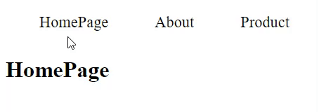
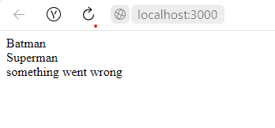

## `HAFTA 4 Konuları`
+ React Router
+ Error Boundary

## `React Router`

React Router, React'te componentler ve sayfalar arasında geçiş yapmamızı sağlayan standart bir React kütüphanesidir.

## `Installing React Router`
#### `npm`
```bash
npm install react-router-dom
```
#### `yarn`
```bash
yarn add react-router-dom
```

Bu yazıda v6.0 ile gelen component ve hooklardan bahsedeceğim.
### `Components`
#### `<BrowserRouter>`
Geçerli konumu tarayıcının adres çubuğunda saklar ve tarayıcını yerleşik geçmiş yığınını kullanarak yönlendirme işlemini gerçekleştirir. Diğer componentler için parent component durumunda olmalıdır.

#### `index.js`
```js
import React from 'react';
import ReactDOM from 'react-dom/client';
import App from '../src/Components/App';
import { BrowserRouter } from "react-router-dom";


const root = ReactDOM.createRoot(document.getElementById('root'));
root.render(
  <React.StrictMode>
    <BrowserRouter>
      <App />
    </BrowserRouter>
  </React.StrictMode>
);
```

#### `<Routes>` and `<Route>`

Routes ve Route geçerli konumda bir şeyleri render etmenin öncelikli elemanlarıdır.Aralarında geçis yapmak istediğimiz componentleri 
`Routes` tarafından kapsanacak şekilde `Route` içine yazarak render işlemini gerçekleştirebiliriz. Burada Route'ı bir if statement olarak düşünebiliriz. Route içindeki `path` attribute'ine yazacağımız lokasyon bilgisni sağladığında yine Route içindeki `element` attribute'i içindeki componente geçiş yapacaktır.

#### `app.js`
```js
import HomePage from "./HomePage";
import About from "./About";
import Product from "./Product";
import { Routes, Route } from "react-router-dom";
import Navbar from "./Navbar";

function App() {
  return (
    <div className="App">
      <Navbar />
      <Routes>
            <Route path="/" element={<HomePage/>} />
            <Route path="/about"  element={<About />}/>
            <Route path="/product"  element={<Product />}/> 
      </Routes>
    </div>
  );
}

export default App;

```

#### `<Link>`
Link elementi kullanıcyı bir tıklama ile farklı sayfalara yönlendirmeye yarar. HTML deki `<a>` taginin görevini görür asılında bura `href` yerine `to` attribute'i kullanılır.

#### `navbar.js`
```js
import React from 'react'
import {Link} from 'react-router-dom'
export default function Navbar() {
  return (
    <div>
        <Link to='/'>HomePage</Link>
        <Link to='/about'>About</Link>
        <Link to='/product'>Product</Link>
    </div>
  )
}
```
##### `yaptığımız küçük demo`



#### `<NavLink>`
Bu element Link elementinin özel bir halidir. Hangi navigasyon elementinin o an aktif olup olmadığını bilir.
```js
<NavLink
        to="tasks"
            className={({ isActive }) =>
              isActive ? activeClassName : undefined
            }
          >
            Tasks
</NavLink>
```

#### `<Navigate>` 
Bu element çağrılıdığında geçerli konumun değişmesini sağlar.
```js
 <Navigate to="/dashboard" replace={true} />
```


#### `<Outlet>`
Bu element nested Route yapmak istediğimizde kullanmamız gerekir. `<Outlet>` elementini, child componentleri render edebilmesi için
parent component içine yazmamız gerekmektedir. 

```js
function Dashboard() {
  return (
    <div>
      <h1>Dashboard</h1>
      {/* This element will render either <DashboardMessages> when the URL is
          "/messages", <DashboardTasks> at "/tasks", or null if it is "/"
      */}
      <Outlet />
    </div>
  );
}
function App() {
  return (
    <Routes>
      <Route path="/" element={<Dashboard />}>
        <Route              //nested Route
          path="messages"
          element={<DashboardMessages />}
        />
        <Route path="tasks" element={<DashboardTasks />} />
      </Route>
    </Routes>
  );
}
```
### `Hooks`

#### `useNavigate`
Bu hook programlanabilir şekilde bir fonksiyon return eder. `replace-true`, yeni bir girdi vermek yerine yığın geçmişindeki girdiyi değiştirir.
```js
import { useNavigate } from "react-router-dom";

function SignupForm() {
  let navigate = useNavigate();

  async function handleSubmit(event) {
    event.preventDefault();
    await submitForm(event.target);
    navigate("../success", { replace: true });
  }

  return <form onSubmit={handleSubmit}>{/* ... */}</form>;
}
```
Yukarıdaki örnekte bir formun submit olduktan sonra hangi lokasyona gideciğini belirleyen bir fonsiyon yazılmıştır.

`navigate(-1) ` yazarak bir önceki lokasyona gidebiliriz.

#### `useParams`
Geçerli URL den paramtereleri almamıza yarar.
```js
import * as React from 'react';
import { Routes, Route, useParams } from 'react-router-dom';

function ProfilePage() {
  // Get the userId param from the URL.
  let { userId } = useParams();
  // ...
}
function App() {
  return (
    <Routes>
      <Route path="users">
        <Route path=":userId" element={<ProfilePage />} />
        <Route path="me" element={...} />
      </Route>
    </Routes>
  );
}
```
#### `useLocation`
Bu hook geçerli lokasyonu return eder.Bu URL'imiz değiştiğinde side-effect'leri kullanmak istediğimizde işimize yarar.

```js
import * as React from 'react';
import { useLocation } from 'react-router-dom';

function App() {
  let location = useLocation();

  React.useEffect(() => {
    ga('send', 'pageview');
  }, [location]);

  return (
    // ...
  );
}
```
Daha fazla biligi edinmek için React-Router'ın orginal [sitesi](https://reactrouter.com/docs/en/v6)'ndeki dokümanı inceleyin.

----

## `Error-Boundary`
Arayüzün bir paçası olan js errorlarını tüm uygulmayı bozmadan handle edebiliriz.Bu React 16 ile gelen bir feature'dır.

React'in sitesindeki dokümana göre aşağıdaki yapılarda error boundaries yakalayamıyoruz:

+ Event handlers
+ Asynchronous code (e.g. setTimeout or requestAnimationFrame callbacks)
+ Server-side rendering
+ Errors are thrown in the error boundary itself rather than its children.


Basit bir React app'i için error boundary'i bir kere tanımlyaıp tüm app'de kullanabiliriz.Ama complex app'ler için birden çok error boundary tanımlayıp farklı componentlerde farklı error boundary'i kullanabiliriz.

#### `Küçük bir demo ile daha iyi kavrayalım`

##### `Hero.js`
Eğer heroName joker'e eşitse bir hata dönmesini istedik.

```js
import React from 'react'

export default function Hero({heroName}) {
  if(heroName==='Joker'){
    throw new Error('Not a hero') 
  }
  return (
    <div>{heroName}</div>
  )
}
```
    
##### `App.js`
Burada children componentlerini ErrorBoundary componenti arasına aldık eğer children'dan dönen bir hata olursa bunu ErrorBoundary ile yakalayıp arayüzde user'a bir hata mesaj döneceğiz.

```js
import React from 'react'
import Hero from './Hero'
import ErrorBoundary from './ErrorBoundary';

export default function App2() {
  return (
    <div>
    <ErrorBoundary>
        <Hero heroName="Batman"/>
    </ErrorBoundary>
    <ErrorBoundary>
        <Hero heroName="Superman"/>
    </ErrorBoundary>
    <ErrorBoundary>
        <Hero heroName="Joker"/>
    </ErrorBoundary>
    </div>
  )
}
```
##### `ErrorBoundary.js`
ErrorBoundary bu component class component'i yapısında olmalıdır aksi halde çalışmayacaktır. `getDerivedStateFromError()` fonksiyonu ile eğer hata varsa hasError state'imizi true hale getiriyoruz. Eğer hasError true ise hata mesajını, değilse children componenti return etmesini istiyoruz. `componentDidCatch()` fonksiyonu ile de hatayı ve hata hakkındaki infoları console ediyoruz.
```js
import React, { Component } from 'react'

export default class ErrorBoundary extends Component {

     constructor(props) {
          super(props)

          this.state = {
            hasError: false
          }
        }

    static getDerivedStateFromError(error) {        
        return { hasError: true };
    }

    componentDidCatch(error,info){
        console.log(error);
        console.log(info);
    }

  render() {
        if(this.state.hasError){
        return  <div>something went wrong</div>
        }
    return this.props.children;
  }
}

```
##### `demo çıktısı aşağıdaki gibi olacaktır.`




